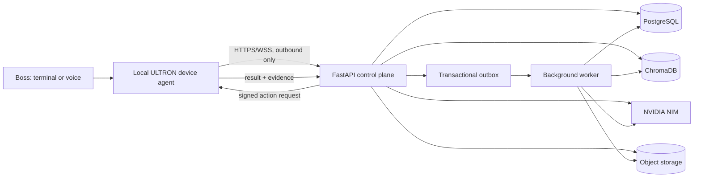
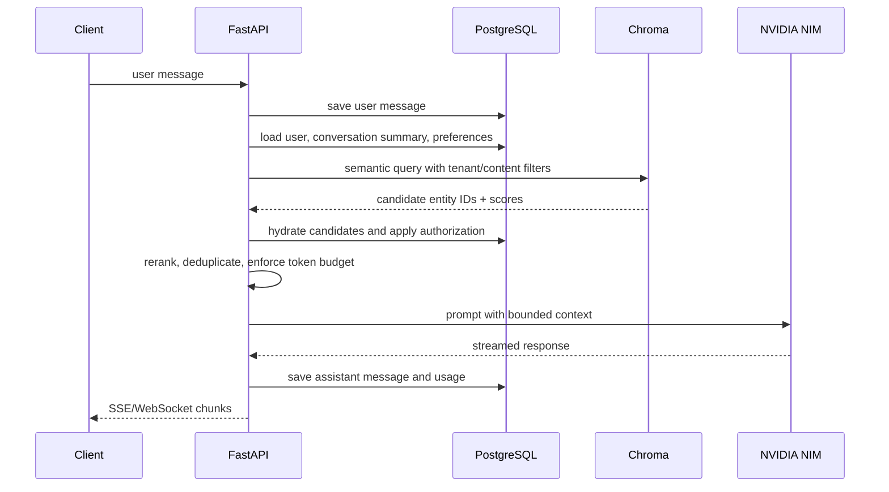

# ULTRON Production Architecture

Status: Proposed  
Target: FastAPI + PostgreSQL + ChromaDB  
AI provider: NVIDIA NIM by default, provider interface retained  
Primary client: terminal/voice desktop assistant  

## 1. Executive decision

Build ULTRON as a modular monolith with separate runtime processes:

1. **FastAPI control plane** — authentication, conversations, memory APIs,
   reminders, tasks, skill policy, orchestration, and streaming responses.
2. **Background worker** — embeddings, Chroma indexing, reminders, ingestion,
   summarization, retries, and cleanup.
3. **Local device agent** — app launching, file access, browser automation,
   clipboard input, voice I/O, and laptop settings. It makes an authenticated
   outbound connection to the control plane.
4. **PostgreSQL** — authoritative transactional data and audit history.
5. **ChromaDB** — derived semantic retrieval index. Chroma is never the only
   copy of user data.
6. **Object storage** — documents, audio, screenshots, PDFs, and generated
   artifacts. PostgreSQL stores metadata and object keys, not large blobs.

Start as one repository and one deployable API image plus one worker image.
Split services only after measured load or security boundaries require it.

## 2. Why this shape fits ULTRON

The current terminal implementation combines intent routing, local execution,
memory, voice, and provider calls in one process. It stores conversation and
workflow records in JSON/JSONL files. The existing `friday/backend` already has
a useful modular FastAPI skeleton, provider abstraction, and initial SQL schema.

The proposed architecture preserves the existing Python skill model while
moving durable and concurrent state into PostgreSQL. It deliberately keeps
privileged Windows actions on the user's laptop. A cloud API should request an
action but must not receive unrestricted filesystem or operating-system access.

## 3. System context



### Trust boundaries

- Internet clients can reach only the reverse proxy/API.
- PostgreSQL and Chroma use private networking and are not publicly exposed.
- The device agent initiates the connection; the server cannot arbitrarily
  connect to the laptop.
- Every high-impact device action requires policy evaluation and, where
  appropriate, interactive confirmation on the device.
- Provider keys remain server-side or in the local device's protected secret
  store. They are never returned through the API.

## 4. Runtime components

### 4.1 FastAPI control plane

Responsibilities:

- REST APIs and WebSocket/SSE streaming.
- Identity, sessions, authorization, quotas, and idempotency.
- Conversation orchestration and prompt construction.
- Skill registry and action policy.
- PostgreSQL transactions.
- Retrieval orchestration: structured SQL filters first, then semantic search.
- Creation of device-action requests.
- Transactional outbox writes in the same transaction as domain changes.

Do not run long embedding, ingestion, email, PDF, video, or research jobs inside
FastAPI request handlers. FastAPI background tasks are suitable only for small,
non-critical post-response work; durable jobs belong in the worker.

### 4.2 Background worker

Run the same codebase with a different entry point. Initial queue transport can
be PostgreSQL itself:

```sql
SELECT id
FROM jobs
WHERE status = 'queued' AND run_after <= now()
ORDER BY priority DESC, created_at
FOR UPDATE SKIP LOCKED
LIMIT 1;
```

This avoids an immediate Redis dependency. Add Redis or a managed queue only
when queue latency, fan-out, or throughput measurements justify it.

Worker job types:

- `memory.embed`
- `memory.delete_embedding`
- `document.extract`
- `document.chunk`
- `document.embed`
- `conversation.summarize`
- `reminder.deliver`
- `device_action.expire`
- `artifact.generate`
- `retention.purge`

All jobs are idempotent, lease-based, retryable, and dead-lettered after a
configured attempt limit.

### 4.3 Local device agent

The existing `core/voice.py` and desktop-oriented `skills/` become the base of
this agent.

Responsibilities:

- Voice capture and speech playback.
- App/browser/file/system actions.
- Local-only path validation and allowlists.
- Confirmation prompts.
- Device capability advertisement.
- Action execution and structured result reporting.
- Offline command support for a minimal safe subset.

The agent maintains one authenticated WebSocket to:

```text
/v1/devices/{device_id}/channel
```

Action messages contain:

- action ID
- action type and version
- validated arguments
- risk level
- confirmation requirement
- expiry timestamp
- idempotency key
- server signature

The agent returns status, timestamps, sanitized output, and optional evidence
such as a screenshot object key. It must never return arbitrary secret files.

### 4.4 PostgreSQL

PostgreSQL is the source of truth for:

- users, devices, and sessions
- conversations and messages
- memories and preferences
- reminders, tasks, calendar events, and notes
- files and document metadata
- skills, permissions, action requests, and action results
- jobs, outbox events, and audit records
- embedding/index state

Use SQLAlchemy async APIs with one `AsyncSession` per request or worker task.
Never share a session across concurrent asyncio tasks.

### 4.5 ChromaDB

Chroma stores searchable chunks and embeddings. Each vector record points to
an authoritative PostgreSQL entity.

Recommended production choices:

- **Managed Chroma Cloud** for high availability and lower operational burden.
- **Self-hosted Chroma server** only on a private network with TLS and an
  authenticating reverse proxy. Chroma 1.x removed built-in authentication, so
  access control must be enforced outside Chroma and inside ULTRON.

ULTRON must be able to delete and rebuild all Chroma collections from
PostgreSQL plus object storage.

### 4.6 Object storage

Use S3-compatible storage for:

- uploaded documents
- recordings and voice mail
- screenshots
- PDFs and generated media
- extracted text snapshots when needed

Use short-lived signed URLs. Enable server-side encryption, versioning,
lifecycle policies, and malware scanning for uploads.

## 5. Repository layout

```text
ultron-platform/
├── apps/
│   ├── api/                    # FastAPI entry point
│   ├── worker/                 # durable job runner
│   └── device_agent/           # terminal, voice, desktop executor
├── src/ultron/
│   ├── api/
│   │   ├── deps.py
│   │   ├── errors.py
│   │   └── v1/
│   ├── domain/
│   │   ├── conversations/
│   │   ├── memory/
│   │   ├── productivity/
│   │   ├── devices/
│   │   └── skills/
│   ├── application/            # use cases, no HTTP/ORM details
│   ├── infrastructure/
│   │   ├── db/
│   │   ├── vector/
│   │   ├── llm/
│   │   ├── storage/
│   │   └── telemetry/
│   ├── skills/                 # typed skill manifests + handlers
│   └── settings.py
├── migrations/                 # Alembic
├── tests/
│   ├── unit/
│   ├── integration/
│   ├── contract/
│   └── e2e/
├── deploy/
│   ├── compose/
│   ├── kubernetes/
│   └── observability/
├── pyproject.toml
└── uv.lock
```

Dependency direction:

```text
API/device adapters -> application use cases -> domain
infrastructure adapters -> application/domain interfaces
domain -> no FastAPI, SQLAlchemy, Chroma, or provider imports
```

## 6. PostgreSQL model

Use UUIDv7-compatible IDs generated by the application, UTC `timestamptz`,
`created_at`, `updated_at`, and optimistic `version` columns on mutable records.

### 6.1 Identity and tenancy

```text
accounts
users
account_memberships
devices
device_sessions
api_sessions
```

Every tenant-owned table contains `account_id NOT NULL`. Enable PostgreSQL Row
Level Security and set a transaction-local account context:

```sql
SET LOCAL app.account_id = '...';
```

Example policy:

```sql
ALTER TABLE memories ENABLE ROW LEVEL SECURITY;
ALTER TABLE memories FORCE ROW LEVEL SECURITY;

CREATE POLICY memories_by_account ON memories
USING (account_id = current_setting('app.account_id')::uuid)
WITH CHECK (account_id = current_setting('app.account_id')::uuid);
```

The application database role must not own tenant tables and must not have
`BYPASSRLS`.

### 6.2 Conversations

```text
conversations
  id, account_id, user_id, title, language_code, status,
  summary, summary_message_id, created_at, updated_at

messages
  id, account_id, conversation_id, role, content,
  content_format, provider, model, token_usage_json,
  correlation_id, created_at

tool_calls
  id, account_id, message_id, skill_name, arguments_json,
  risk_level, status, result_json, created_at, completed_at
```

Partition `messages` by month only after table size and maintenance costs
justify it. Partitioning should be an operational decision based on measured
growth, not a day-one ritual.

### 6.3 Memory

```text
memories
  id, account_id, user_id, namespace, kind, content,
  metadata_json, importance, source_type, source_id,
  expires_at, embedding_status, content_hash,
  created_at, updated_at, deleted_at

memory_links
  from_memory_id, to_memory_id, relationship, metadata_json

memory_access_log
  memory_id, conversation_id, query_id, rank, score, used_in_prompt, created_at
```

Indexes:

```sql
CREATE INDEX memories_account_kind_created_idx
  ON memories (account_id, kind, created_at DESC)
  WHERE deleted_at IS NULL;

CREATE INDEX memories_metadata_gin_idx
  ON memories USING GIN (metadata_json jsonb_path_ops);

CREATE UNIQUE INDEX memories_source_unique_idx
  ON memories (account_id, source_type, source_id)
  WHERE source_id IS NOT NULL AND deleted_at IS NULL;
```

### 6.4 Productivity

```text
tasks
reminders
calendar_events
notes
study_plans
learning_events
```

Reminders store:

```text
due_at, timezone, recurrence_rule, status, delivery_channels,
last_delivered_at, next_attempt_at, deduplication_key
```

Never use an in-process timer as the only reminder mechanism. The worker
claims due reminders from PostgreSQL and records delivery attempts.

### 6.5 Files and knowledge ingestion

```text
files
  id, account_id, owner_id, object_key, original_name, media_type,
  byte_size, sha256, scan_status, extraction_status, created_at

documents
  id, account_id, file_id, title, source_uri, language_code,
  extraction_version, content_hash, created_at, updated_at

document_chunks
  id, account_id, document_id, ordinal, text, token_count,
  heading_path, metadata_json, content_hash, embedding_status
```

### 6.6 Device actions and audit

```text
device_actions
  id, account_id, device_id, requested_by, skill_name, arguments_json,
  risk_level, requires_confirmation, status, expires_at,
  idempotency_key, created_at, started_at, completed_at

device_action_results
  action_id, success, result_json, error_code, evidence_file_id, created_at

audit_events
  id, account_id, actor_type, actor_id, event_type,
  resource_type, resource_id, outcome, metadata_json,
  ip_address, user_agent, created_at
```

Partition high-volume `audit_events` by month and apply a retention policy.

### 6.7 Jobs and outbox

```text
jobs
  id, account_id, job_type, payload_json, status, priority,
  attempts, max_attempts, run_after, lease_owner, lease_expires_at,
  last_error, created_at, updated_at

outbox_events
  id, aggregate_type, aggregate_id, event_type, payload_json,
  status, attempts, available_at, created_at, published_at
```

Domain changes and their outbox records are committed in one PostgreSQL
transaction.

## 7. Chroma data design

### 7.1 Namespaces

Use one Chroma tenant/database per environment and application. For a personal
single-account deployment, use collections by embedding model and content type:

```text
ultron_memory_v1
ultron_documents_v1
ultron_code_v1
```

For multi-account deployments:

- Prefer Chroma tenant/database isolation where supported.
- Otherwise use a collection per account for strong isolation.
- Do not depend only on a metadata `account_id` filter for sensitive
  multi-tenant isolation.

### 7.2 Vector record

```json
{
  "id": "chunk-or-memory-uuid",
  "document": "searchable text",
  "metadata": {
    "account_id": "uuid",
    "entity_type": "memory",
    "entity_id": "uuid",
    "namespace": "preference",
    "language": "te",
    "source_type": "conversation",
    "source_id": "uuid",
    "content_hash": "sha256",
    "embedding_model": "model-name",
    "embedding_version": 1,
    "created_at_epoch": 1782086400
  }
}
```

Keep metadata small and filter-oriented. Rich metadata remains in PostgreSQL.

### 7.3 Embedding consistency

Write flow:

1. API writes/updates PostgreSQL record.
2. API writes `memory.upsert_requested` to `outbox_events` in the same
   transaction.
3. Worker claims the event.
4. Worker loads authoritative content from PostgreSQL.
5. Worker computes embedding and upserts Chroma using the PostgreSQL UUID.
6. Worker updates `embedding_status`, model, version, and timestamp in
   PostgreSQL.
7. Worker marks the outbox event complete.

Delete flow:

1. Soft-delete record in PostgreSQL.
2. Emit delete event.
3. Remove Chroma record.
4. Purge PostgreSQL/object data later according to retention policy.

Reconciliation job:

- compares PostgreSQL `content_hash`/embedding version with Chroma metadata
- requeues missing or stale vectors
- removes orphaned Chroma records

### 7.4 Retrieval pipeline



Rules:

- Chroma results are identifiers, not trusted authorization decisions.
- Hydrate every result from PostgreSQL under RLS.
- Filter expired, deleted, and superseded memories.
- Use recency, importance, semantic score, and diversity in reranking.
- Log which memories were actually inserted into the prompt.
- Summarize old conversation turns instead of sending unbounded history.

## 8. API surface

Base path: `/v1`

### Identity and devices

```text
POST   /auth/token
POST   /auth/refresh
GET    /me
POST   /devices/register
GET    /devices
POST   /devices/{id}/revoke
WS     /devices/{id}/channel
```

### Conversations

```text
POST   /conversations
GET    /conversations
GET    /conversations/{id}
POST   /conversations/{id}/messages
GET    /conversations/{id}/messages
POST   /conversations/{id}/stream
DELETE /conversations/{id}
```

Use SSE for model token streaming unless bidirectional communication is
required. Use WebSocket for the device channel.

### Memory

```text
POST   /memories
GET    /memories
GET    /memories/{id}
PATCH  /memories/{id}
DELETE /memories/{id}
POST   /memories/search
POST   /memories/reindex
```

### Productivity

```text
/tasks
/reminders
/calendar-events
/notes
/study-plans
```

Each supports standard create/list/get/update/delete operations with cursor
pagination and version-based conditional updates.

### Files

```text
POST   /files/upload-url
POST   /files/{id}/complete
GET    /files/{id}
GET    /files/{id}/download-url
POST   /files/{id}/ingest
DELETE /files/{id}
```

### Skills and actions

```text
GET    /skills
POST   /skills/{name}/invoke
GET    /actions/{id}
POST   /actions/{id}/confirm
POST   /actions/{id}/cancel
```

### Operations

```text
GET /health/live
GET /health/ready
GET /metrics
```

`live` checks only process health. `ready` verifies required dependencies with
tight timeouts.

## 9. API behavior

- Pydantic request/response contracts; never return ORM models directly.
- Cursor pagination, not large offset pagination.
- `Idempotency-Key` required for create, send, submit, and device-action APIs.
- Consistent RFC 9457-style problem responses.
- Correlation ID propagated through API, worker, NIM, device agent, and logs.
- Strict request size limits and upload limits.
- Timeouts and cancellation propagated to provider calls.
- Provider responses streamed while the final message is durably persisted.
- OpenAPI is generated in CI and checked for breaking changes.

## 10. Security

### Authentication

- OIDC/OAuth2 authorization code with PKCE for interactive clients.
- Short-lived access tokens and rotating refresh tokens.
- Device-bound credentials for local agents.
- Passwordless or external identity provider preferred.

### Authorization

- Application-level authorization plus PostgreSQL RLS.
- Per-skill scopes such as `memory:read`, `files:write`,
  `device:system-control`, and `email:send`.
- Device action policy assigns risk:
  - low: open website, read time
  - medium: edit file, change volume
  - high: send email, submit coursework, delete file
  - critical: shutdown, credential changes, arbitrary code
- High and critical actions require fresh interactive confirmation.

### Secrets

- Use a cloud secret manager or OS credential vault.
- Do not store provider keys in PostgreSQL, Chroma metadata, logs, or prompts.
- Rotate keys and support provider-specific scoped credentials.

### Prompt and tool security

- Treat email, web pages, documents, and retrieved memories as untrusted data.
- Separate instructions from retrieved content in prompts.
- Allow only registered typed skills; never execute model-generated shell text.
- Validate paths on the device with resolved-path allowlists.
- Sandbox coding execution with CPU, memory, time, filesystem, and network
  limits.

### Chroma security

- Private network only.
- TLS through service mesh/reverse proxy.
- API-side authorization before every query.
- Separate tenant/database/collection boundaries as appropriate.
- Never expose Chroma credentials to the terminal client.

## 11. Reliability and consistency

- PostgreSQL transaction per use case.
- Transactional outbox for all cross-system writes.
- At-least-once workers plus idempotent handlers.
- Unique idempotency constraints.
- Provider retry only for safe transient failures with exponential backoff and
  jitter.
- Circuit breakers for NIM, Chroma, email, and third-party APIs.
- Bulkheads: separate worker concurrency pools for embeddings, document
  extraction, and user-visible jobs.
- Graceful shutdown stops accepting work, drains requests, and releases leases.

Suggested initial service-level objectives:

```text
API availability:              99.9%
Read API p95:                  < 300 ms excluding model/vector calls
Memory search p95:             < 800 ms
First streamed model token:    < 3 s under normal provider conditions
Reminder enqueue lag p99:      < 30 s
Device action dispatch p95:    < 2 s for connected devices
Embedding convergence p99:     < 2 min
```

## 12. Observability

Use OpenTelemetry across API and worker.

Metrics:

- request count, latency, status, route
- active streams and device connections
- PostgreSQL pool utilization and transaction latency
- Chroma query/upsert latency and error rate
- queue depth, lease age, retry count, dead letters
- NIM latency, tokens, model, error rate, estimated cost
- retrieval candidate count and prompt-use count
- reminder delivery delay
- device action confirmation and failure rates

Logs are structured JSON with correlation IDs. Redact prompts, emails, file
contents, authorization headers, and secrets by default. Store detailed prompt
traces only behind explicit opt-in and short retention.

Alerts:

- readiness failures
- PostgreSQL replication lag / storage pressure
- Chroma unavailable or reconciliation drift
- outbox oldest-event age
- dead-letter growth
- abnormal provider cost/token usage
- repeated device action failures

## 13. Deployment

### Local development

Docker Compose:

```text
api
worker
postgres
chroma
minio
otel-collector
```

The device agent runs directly on Windows because containers should not control
the host desktop.

### Production

Recommended:

- managed PostgreSQL with multi-zone standby
- Chroma Cloud, or private self-hosted Chroma with documented backup/rebuild
- managed object storage
- API and workers as separate containers
- one Uvicorn process per Kubernetes container, scaled horizontally
- reverse proxy/ingress for TLS, request limits, and security headers
- separate migration job before rollout

Do not run schema migrations independently in every API replica.

### Connection management

- Async SQLAlchemy engine.
- One `AsyncSession` per request/task.
- Bounded pool sized against PostgreSQL `max_connections`.
- PgBouncer in transaction mode when replica counts grow.
- Statement, lock, and idle transaction timeouts.

## 14. Backup and disaster recovery

PostgreSQL:

- automated base backups
- continuous WAL archiving
- point-in-time recovery
- tested restore drills
- cross-region copy according to recovery requirements

Object storage:

- versioning
- lifecycle and retention policies
- replication where needed

Chroma:

- use provider-supported backup for managed deployments
- retain source content and embedding metadata in PostgreSQL/object storage
- maintain a tested full reindex command

Initial targets:

```text
PostgreSQL RPO: 5 minutes or better
PostgreSQL RTO: 30 minutes
Chroma RPO: rebuildable from PostgreSQL
Chroma RTO: 2 hours for full reindex, refine after measuring corpus size
```

## 15. Migration from current ULTRON

### Phase 0 — contracts and tests

- Freeze current command behavior with integration tests.
- Define `SkillContext`, typed skill arguments, typed results, and risk metadata.
- Introduce repository interfaces around current file memory.

### Phase 1 — PostgreSQL foundation

- Add SQLAlchemy 2.x async, Alembic, and PostgreSQL.
- Create accounts, users, conversations, messages, memories, productivity,
  device actions, jobs, outbox, and audit tables.
- Import `data/memory.txt` and local JSON records with a repeatable migration.
- Preserve original timestamps and store source hashes.

### Phase 2 — FastAPI control plane

- Reuse the existing `friday/backend` provider abstraction and modular routing.
- Replace per-request construction of providers/stores with lifespan-managed
  application services.
- Add authentication, RLS context, versioned routes, idempotency, and error
  contracts.

### Phase 3 — device agent

- Move voice and desktop skills behind typed local executors.
- Establish device registration and an outbound WebSocket.
- Add capability negotiation, action confirmation, expiry, and audit evidence.

### Phase 4 — Chroma semantic memory

- Add document chunking and embedding adapters.
- Implement outbox-driven indexing.
- Add hybrid structured/semantic retrieval and reconciliation.
- Backfill existing memories and conversations.

### Phase 5 — production hardening

- Object storage and malware scanning.
- OpenTelemetry, dashboards, alerts, load tests, chaos tests, and restore drills.
- Multi-zone database, TLS everywhere, secret manager, and automated key
  rotation.

## 16. Implementation dependencies

Use locked, reviewed versions rather than unconstrained minimums:

```text
fastapi
uvicorn[standard]
pydantic-settings
sqlalchemy[asyncio]
asyncpg
alembic
chromadb (thin HTTP client in API/worker)
httpx
structlog
opentelemetry-sdk + FastAPI/SQLAlchemy/httpx instrumentation
python-jose or an OIDC client library
tenacity (bounded infrastructure retries)
```

Use `uv.lock` and automated dependency/security update PRs.

## 17. Architecture decisions

1. **Modular monolith first.** It provides clean boundaries without premature
   distributed-system complexity.
2. **PostgreSQL is authoritative.** Chroma is a query accelerator and can be
   rebuilt.
3. **Outbox over dual writes.** PostgreSQL and Chroma cannot share an atomic
   transaction.
4. **Local device agent for privileges.** Public infrastructure never directly
   controls the laptop.
5. **Async only at I/O boundaries.** Domain logic stays ordinary testable
   Python.
6. **Managed stateful services preferred.** Operating databases correctly is
   harder than operating stateless API containers.
7. **Typed skills, not arbitrary tool execution.** This is essential for a
   personal assistant that can affect files, email, and system settings.

## 18. Official references

- FastAPI deployment concepts:
  https://fastapi.tiangolo.com/deployment/concepts/
- FastAPI containers:
  https://fastapi.tiangolo.com/deployment/docker/
- FastAPI workers:
  https://fastapi.tiangolo.com/deployment/server-workers/
- SQLAlchemy asyncio:
  https://docs.sqlalchemy.org/en/latest/orm/extensions/asyncio.html
- SQLAlchemy session concurrency:
  https://docs.sqlalchemy.org/en/latest/orm/session_basics.html
- PostgreSQL row-level security:
  https://www.postgresql.org/docs/current/ddl-rowsecurity.html
- PostgreSQL JSONB indexes:
  https://www.postgresql.org/docs/current/datatype-json.html
- PostgreSQL partitioning:
  https://www.postgresql.org/docs/current/ddl-partitioning.html
- PostgreSQL PITR:
  https://www.postgresql.org/docs/current/continuous-archiving.html
- Chroma architecture and tenancy:
  https://docs.trychroma.com/reference/architecture/overview
- Chroma collection/query API:
  https://docs.trychroma.com/reference/chroma-api/record/query-collection
- Chroma collection and chunking guidance:
  https://docs.trychroma.com/guides/build/look-at-your-data
- Chroma migrations and authentication change:
  https://docs.trychroma.com/docs/overview/migration
- Chroma Cloud production characteristics:
  https://docs.trychroma.com/cloud/getting-started
